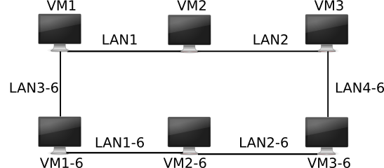
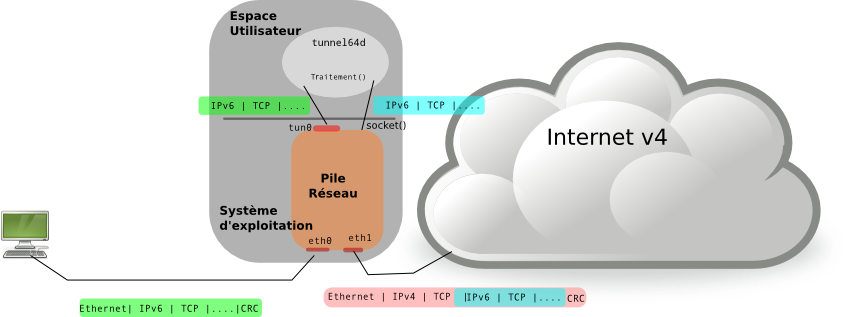

# Network TUN


## Name
Network "tunneling" project.

## Description

Consider the topology and configuration of the base network: consisting of two IPv4 and IPv6 networks, composed of a set of machines.
Suppose the link between machines exclusively on the IPv6 network is disrupted (e.g., VM2-6 is off), making communication within this network impossible.
The only possible communication is by routing traffic through the IPv4 network.


The goal of this project is to enable communication between IPv6 islands by using simple tunnels over IPv4.
To achieve this, we will connect our two IPv6 islands through the IPv4 network by creating an IPv6-over-IPv4 tunnel between VM1 and VM3 (see figure).

## Problem Overview

    ---------------------------------------IPv4 Network (IPv6 over IPv4)-------------------------------------
    |                                                                                                       |
    +---------+                                       +----------+                                      +---------+
    |   VM1   |              Tunnel (ext.1)           |   VM2    |             Tunnel (ext.2)           |   VM3   |
    |  [tun0] |ipv4(eth1) <---------------> ipv4(eth1)|[router]  |ipv4(eth2) <--------------> ipv4(eth1)|  [tun1] |
    |  (ipv6) |                                       |          |                                      |  (ipv6) |
    +---------+                                       +----------+                                      +---------+
    Ipv6(eht2)                                                                                           Ipv6(eht2)
         ^                                                                                                  ^   
         |                                                                                                  |   
         |                                                                                                  |
         |                                                                                                  |
         v                                                                                                  v
    Ipv6(eht2)                                                                                          Ipv6(eht2)
    +---------+                                       +----------+                                      +---------+
    |         |           [Disconnected Link]         |   VM2-6  |           [Disconnected Link]        |         |
    |  VM1-6  | ipv6(eth1)<---! X     X !-->ipv6(eth1)| [router] |ipv6(eth2)<---! X     X !-->ipv6(eth1)|  VM3-6  |
    |         |                                       |          |                                      |         |
    +---------+                                       +----------+                                      +---------+
    |                                                                                                        |
    --------------------------------------------------IPv6 Networks-------------------------------------------

Here, `tun0` and `tun1` are virtual network interfaces on two separate machines, while `ext.1` and `ext.2` are the tunnel endpoints.

The following image illustrates the tunnel's functionality:


## Project Structure

- [x] `images/`: Contains illustrative images and wireshark's traffic sreenshots:
- [x] `v_machines/`: Contains directories representing virtual machines and their configurations.
    - [x] `VM1`, `VM2`, `VM3`, `VM1-6`, `VM2-6`, `VM3-6`: Each contains the virtual machines and their respective configuration files.
    - [x] `shared/`: Contains Python scripts and tunnel configuration files.
        - `extremity.py/`: Manages traffic between the tunnel's endpoints.
        - `iftun.py/`: Contains the code for tunnel creation.
        - `processing.py/`: Manages IPv6 packet encapsulation and decapsulation.
        - `tuninit.py/`: Initializes the `Iftun` library to create the virtual interface and start communication from a machine (e.g., VM1 or VM3).
        - `tunnel64d.sh/`: Reads configuration from `tun_side1.txt` or `tun_side2.txt` and calls `tuninit.py` to initialize a tunnel with the specified data.
        - `tun_side1.txt/` and `tun_side2.txt/`: Contain configuration for each tunnel endpoint, used by `tunnel64d.sh`.

## Usage
Note : we used a preinstalled "debian" disk image (a minimalist version of Debian/XFCE) for our VMs.

Once the virtual machines are running:
Download (zip) or Clone the project using a terminal in a specific folder:

```
clone the repository
cd ipv6over4_tun/v_machines/
# Navigate to /mnt/shared and grant execution privileges to the following file:
sudo chmod +x tunnel64d.sh

# From VM1, execute:
root@VM1:/mnt/shared# ./tunnel64d.sh tun_side1.txt or root@VM1:/mnt/shared# ./tunnel64d.sh tun_side1.txt | hexdump -C

# From VM3, execute:
root@VM3:/mnt/shared# ./tunnel64d.sh tun_side2.txt or root@VM3:/mnt/shared# ./tunnel64d.sh tun_side2.txt | hexdump -C

```

## Author
- [Brahim Haroun Hassan]

## License
Academic Free License ("AFL") v. 3.0

## Project Status
Ongoing...

## References
- [Network Project](https://pageperso.lis-lab.fr/emmanuel.godard/enseignement/tps-reseaux/projet/)
