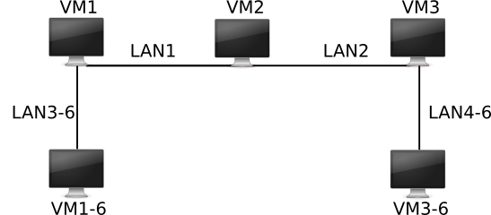

# Réseau

<!-- ```
cd existing_repo
git remote add origin https://etulab.univ-amu.fr/master-1/complexite.git
git branch -M main
git push -uf origin main
``` -->

## Nom
Projet de Réseau.

## Description
Le but de ce projet est de permettre des communications entre îlots IPv6 en utilisants des tunnels simples au-dessus de IPv4.

Ce pendant, nous allons relier nos deux îlots IPv6 via le réseau IPv4 en créant un tunnel IPv6 sur IPv4 entre VM1 et VM3 (voir figure).

## Structure du projet

- [x] `images/`: contenant l'image d'illustration:
    - `reseau6-tun.png` 
- [x] `v_machines/`: contient les dossiers répresentant les machines virtuelles et leur configurations. 
    - [x] `partage/`: contient tous les scripts python et fichiers de configuration du tunnel.
        - `extremity.py/`: Contient le code servant à gérer le trafic entre extrémités du tunnel.
        - `iftun.py/`: contient tous le code permettant la création du tunnel.
        - `processing.py/`: contient le données nécessaire au traitement d'encapsulation et decapsulation des paquets réçus.
        - `tuninit.py/`: Script permettant d'initialiser la bibliothèque `Iftun` afin de créer l'interface virtuelle et lancer le server permettant la communication à partir d'une machine (ex. VM1 ou VM3).
        - `tunnel64d.sh/`: permet de lire la configuration contenue dans `tun_side1.txt` ou `tun_side2.txt` et appeler `tuninit.py` pour initialiser un tunnel avec les données adéquats.
        - `tun_side1.txt/` et `tun_side2.txt/`: Contiennent les configuration sélon l'extrimité du tunnel choisi, servant d'entrée au fichier `tunnel64d.sh`.


## Usage
Cloner le projet via un terminal dans un dossier donné :
```
clone https://etulab.univ-amu.fr/b24024546/projet_reseau.git
cd projet_reseau/v_machines/

# Une fois les machines virtuelles lanchées:
# Naviguer vers : '/mnt/partage/',  et donner le privilège d'exécution au fichier suivant:

sudo chmod +x tunnel64d.sh

# A partir de VM1, faire:
./conf1.sh tun_side1.txt

# A partir de VM3, faire:
./conf1.sh tun_side2.txt

```

## Auteurs 
- [Brahim Haroun Hassan]
- [DIALLO Ismaila]
- [GUERRIER Vanessa]


## License
Academic Free License ("AFL") v. 3.0

## Statut du projet
En cours.

# Références

- [Projet Réseaux](https://pageperso.lis-lab.fr/emmanuel.godard/enseignement/tps-reseaux/projet/)