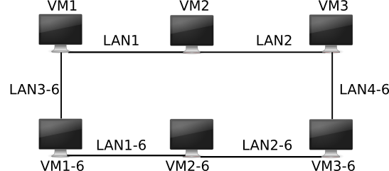

# Réseau

<!-- ```
cd existing_repo
git remote add origin https://etulab.univ-amu.fr/master-1/complexite.git
git branch -M main
git push -uf origin main
``` -->

=======
## Nom
=======
Projet de Réseau.

==============
## Description
==============

Soit la topologie et configuration du réseau de base: constitué de deux réseaux IPv4 et IPv6, composé d'un ensemble de machines.
Sachant que le lien entre les machines appartenant uniquement au réseaux IPv6 est coupé, ce qui rend impossible la communication entre les machines dudit réseaux. 
L'unique possbilité de communication est de faire transiter le trafic par le réseau IPv4.  



Le but de ce projet est de permettre des communications entre îlots IPv6 en utilisants des tunnels simples au-dessus de IPv4.
Ce pendant, nous allons relier nos deux îlots IPv6 via le réseau IPv4 en créant un tunnel IPv6 sur IPv4 entre VM1 et VM3 (voir figure).


========================
## Overview du problème
========================

    ----------------------------------------Réseau Ipv4 (IPv6 via Ipv4)--------------------------------------------
    |                                                                                                             |
    +---------+                                      +----------+                                       +---------+
    |   VM1   |              Tunnel (ext.1)          |    VM2   |          Tunnel (ext. 2)              |   VM3   |
    |  [tun0] | ipv4(eth1) <-------------> ipv4(eth1)|[routeur] |ipv4(eth2) <--------------> ipv4(eth1) |  [tun1] |
    |  (ipv6) |                                      |          |                                       |  (ipv6) |
    +---------+                                      +----------+                                       +---------+
    Ipv6(eht2)                                                                                           Ipv6(eht2)
         ^                                                                                                  ^   
         |                                                                                                  |   
         |                                                                                                  |
         |                                                                                                  |
         v                                                                                                  V
    Ipv6(eht2)                                                                                          Ipv6(eht2)    
    +---------+                                       +----------+                                      +---------+
    |         |               [Lien coupé]            |  VM2-6   |              [Lien coupé]            |         |
    |  VM1-6  | ipv6(eth1)<---! X     X !-->ipv6(eth1)|[routeur] |ipv6(eth2)<---! X     X !-->ipv6(eth1)|  VM3-6  |
    |         |                                       |          |                                      |         |
    +---------+                                       +----------+                                      +---------+
    |                                                                                                             |
    ---------------------------------------------------Réseaux pv6-------------------------------------------------
                     
Où `tun0` et `tun1` sont des interfaces réseaux virtuelles sur deux machines distinctes; `ext.1` et `ext.2` sont respectevement les extrémités 1 et 2  du tunnel

L'image suivante illustre le fonctionnement du tunnel.


=======================
## Structure du projet
=======================

- [x] `images/`: contenant l'image d'illustration:
    - `reseau6-tun.png` 
- [x] `v_machines/`: contient les dossiers répresentant les machines virtuelles et leur configurations. 
    - [x] `partage/`: contient tous les scripts python et fichiers de configuration du tunnel.
        - [x] `iperf3_output/`: 
            - `out.csv/`: Contient les données de sortie du test `iperf3`.
        - `extremity.py/`: Contient le code servant à gérer le trafic entre extrémités du tunnel.
        - `iftun.py/`: contient tous le code permettant la création du tunnel.
        - `processing.py/`: contient le données nécessaire au traitement d'encapsulation et decapsulation des paquets réçus.
        - `tuninit.py/`: Script permettant d'initialiser la bibliothèque `Iftun` afin de créer l'interface virtuelle et lancer le server permettant la communication à partir d'une machine (ex. VM1 ou VM3).
        - `tunnel64d.sh/`: permet de lire la configuration contenue dans `tun_side1.txt` ou `tun_side2.txt` et appeler `tuninit.py` pour initialiser un tunnel avec les données adéquats.
        - `tun_side1.txt/` et `tun_side2.txt/`: Contiennent les configuration sélon l'extrimité du tunnel choisi, servant d'entrée au fichier `tunnel64d.sh`.
    - [x] `VM1`, `VM2`, `VM3`, `VM1-6`, `VM3-6`: Contiennent tous les les machines virtuelles et leurs différents fichiers de configuration.


=========
## Usage
=========
Cloner le projet via un terminal dans un dossier donné :
```
clone https://etulab.univ-amu.fr/b24024546/projet_reseau.git
cd projet_reseau/v_machines/

# Une fois les machines virtuelles lancées:
# Naviguer vers : '/mnt/partage/', et donner le privilège d'exécution au fichier suivant:

sudo chmod +x tunnel64d.sh

# A partir de VM1, faire:
root@VM1:mnt/partage# ./tunnel64d.sh tun_side1.txt 
            ou
root@VM1:mnt/partage#./tunnel64d.sh tun_side1.txt | hexdump -C

# A partir de VM3, faire:
root@VM3:mnt/partage#./tunnel64d.sh tun_side2.txt
            ou
root@VM3:mnt/partage#./tunnel64d.sh tun_side2.txt | hexdump -C

```

===========
## Auteurs 
===========
- [Brahim Haroun Hassan]
- [DIALLO Ismaila]
- [GUERRIER Vanessa]


===========
## License
===========

Academic Free License ("AFL") v. 3.0

====================
## Statut du projet
====================
En cours.

=============
# Références
=============

- [Projet Réseaux](https://pageperso.lis-lab.fr/emmanuel.godard/enseignement/tps-reseaux/projet/)